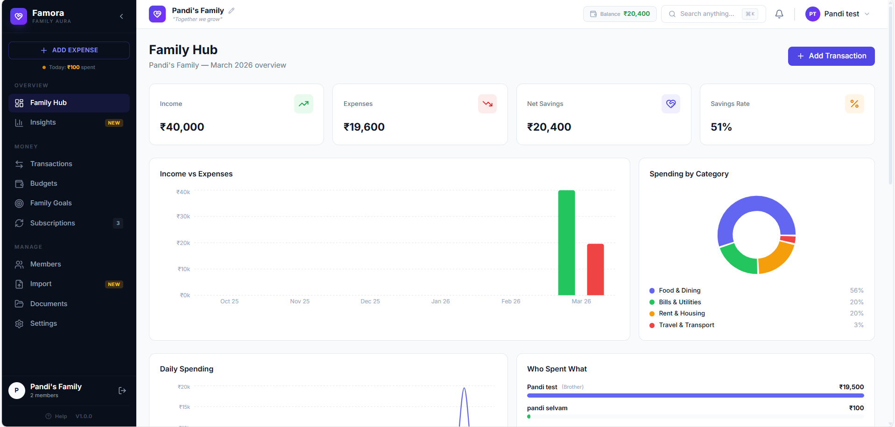
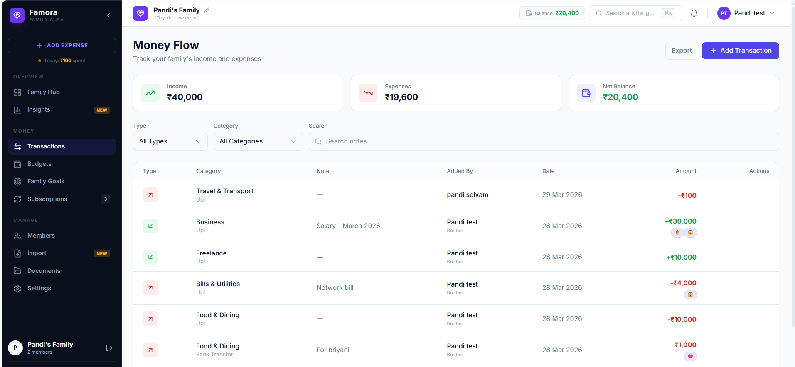
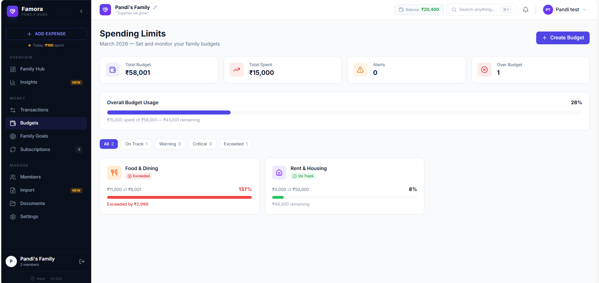
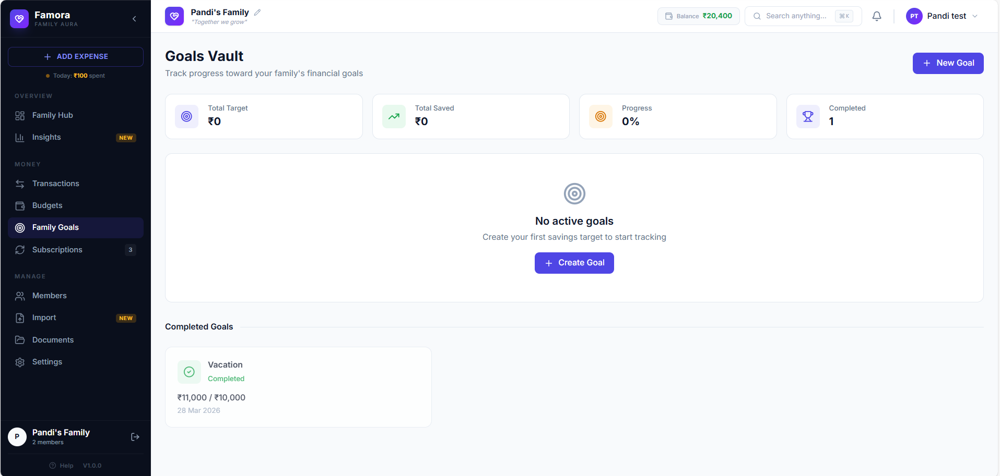
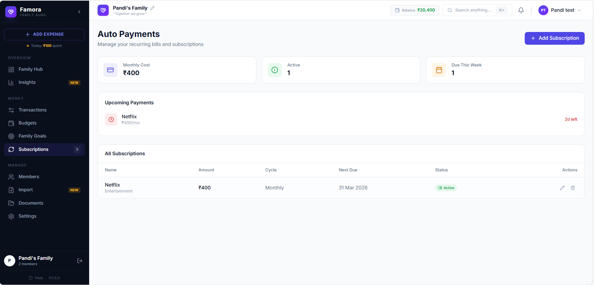
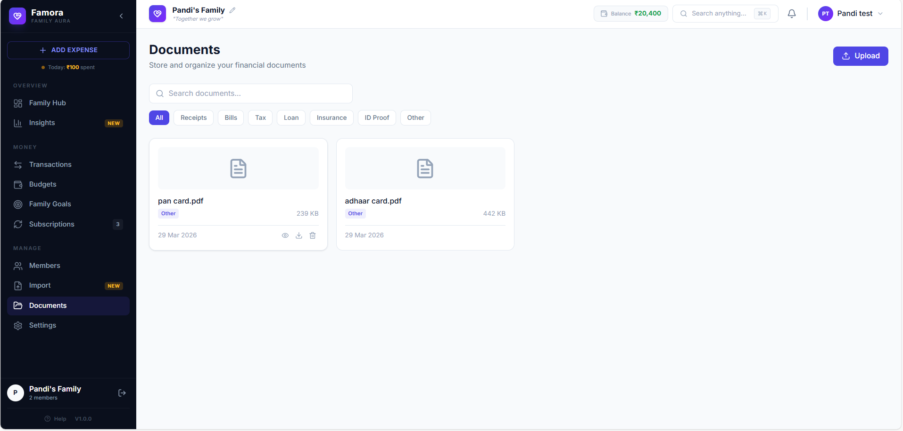

<div align="center">


# Famora

### Your Family's Finances, United.

[](https://react.dev)
[](https://nestjs.com)
[](https://www.mongodb.com)
[](https://www.typescriptlang.org)
[](https://tailwindcss.com)
[](LICENSE)

**The open-source family finance app that no individual tracker can replace.**<br/>
Track expenses, set budgets, save toward goals — together as a family.

[Getting Started](#-getting-started) &bull; [Features](#-features) &bull; [Screenshots](#-screenshots) &bull; [Tech Stack](#-tech-stack) &bull; [API Docs](#-api-overview)

</div>

---

## The Problem

Every finance app is built for **one person**. But families share money, split bills, and save together. There's no good tool for that.

**Famora fixes this.** One app where every family member can:
- Add expenses and see who spent what
- React to each other's spending with emoji
- Track shared budgets and savings goals
- Get a live activity feed of family finances
- Import bank statements with auto-categorization

---

## Screenshots

<div align="center">

### Dashboard
*Real-time family financial overview with charts, health score, and activity feed*



<br/><br/>

<table>
<tr>
<td width="50%">

### Transactions
*Track every expense with reactions, pins, and filters*



</td>
<td width="50%">

### Budgets
*Monthly spending limits with real-time progress*



</td>
</tr>
<tr>
<td width="50%">

### Family Goals
*Save together with progress tracking and contributions*



</td>
<td width="50%">

### Subscriptions
*Track recurring bills and upcoming due dates*



</td>
</tr>
<tr>
<td colspan="2">

### Documents
*Upload and organize receipts, bills, tax papers*



</td>
</tr>
</table>

</div>

---

## Features

### Core Modules

<table>
<tr>
<td>

**Family System**<br/>
Create family, invite members via email with auto-generated passwords. Relationships: spouse, parents, siblings, kids.

</td>
<td>

**Expense Tracking**<br/>
Full CRUD with 14+ categories, payment methods, notes. Filter by type, category, member, date, search.

</td>
<td>

**Smart Budgets**<br/>
Monthly limits per category. Spent amount auto-calculated from real expenses. Status: safe / warning / danger / exceeded.

</td>
</tr>
<tr>
<td>

**Savings Goals**<br/>
Family goals with contributions, deadlines, priority. Auto-marks complete when target reached.

</td>
<td>

**Dashboard**<br/>
Income vs expense charts, category pie, daily line, member comparison bars, health score gauge, activity feed.

</td>
<td>

**Analytics**<br/>
6-month trends, daily spending, top expenses, member breakdown. All from real data.

</td>
</tr>
</table>

### What Makes Famora Unique

| Feature | Why It Matters |
|---------|---------------|
| **Family Activity Feed** | "Mom added Rs.850 Groceries" — live social feed for money. No individual tracker has this. |
| **Expense Reactions** | React with emoji (thumbs up, fire, shock, love). Fun + accountability. |
| **Pin Important Expenses** | Pin rent, salary to top. Always visible. |
| **Financial Health Score** | 0-100 score from savings rate (40%) + budget adherence (30%) + goal progress (20%) + consistency (10%). |
| **Month-over-Month Comparison** | "Food: +23% vs last month" — per-category spending arrows. |
| **Bank Statement Import** | Upload CSV from any Indian bank. Auto-categorize 50+ keywords (Swiggy, Uber, Amazon...). Review before importing. |
| **Member Spending Comparison** | Visual bars showing who spent how much. Family transparency. |
| **Invite via Email** | One click to invite. They get email with temp password. Login and change. |
| **Spotlight Search** | Cmd+K search across the entire app. |

### Also Included

- **Subscriptions** — Track recurring bills with due date alerts and monthly total
- **Documents** — Upload receipts, bills, tax docs (PDF, JPG, PNG, WEBP). Category filters.
- **Notifications** — In-app alerts for large expenses (Rs.5000+), with bell dropdown and unread count
- **Profile & Avatar** — Upload photo, update name/phone via Multer
- **CSV Export** — Download all transactions as CSV
- **Today's Spending** — Live counter on sidebar
- **404 & 401 Pages** — Beautiful error pages

---

## Tech Stack

<table>
<tr>
<td align="center" width="33%">

**Frontend**

React 19<br/>
TypeScript<br/>
Vite 8<br/>
Tailwind CSS v4<br/>
Recharts<br/>
Zustand<br/>
Axios<br/>
React Router v7<br/>
React Hot Toast<br/>
Lucide Icons

</td>
<td align="center" width="33%">

**Backend**

NestJS 11<br/>
TypeScript<br/>
Mongoose ODM<br/>
JWT + Passport<br/>
Multer (uploads)<br/>
Swagger (API docs)<br/>
class-validator<br/>
bcrypt<br/>
my-utils-helpers (SMTP)<br/>
Helmet + CORS

</td>
<td align="center" width="33%">

**Database & Tools**

MongoDB<br/>
UUID (no ObjectId)<br/>
Global response format<br/>
Global error handler<br/>
Activity logging<br/>
Notification system<br/>
Bank CSV parser<br/>
Auto-categorization<br/>
File upload system<br/>
Seed script

</td>
</tr>
</table>

---

## Getting Started

### Prerequisites

- **Node.js** 18+
- **MongoDB** running locally or [Atlas](https://www.mongodb.com/atlas) URI
- **npm**

### 1. Clone & Install

```bash
git clone https://github.com/Pandi2352/Famora---Family-Aura-for-Your-Finances.git
cd famora

# Install backend
cd server && npm install

# Install frontend
cd ../client && npm install
```

### 2. Configure Environment

```bash
cd server
cp .env.example .env
# Edit .env with your MongoDB URI and SMTP credentials
```

### 3. Seed Default User

```bash
npm run seed
```

```
Created user: Pandi (pandi@famora.app)
Created family: Pandi's Family

Email:    pandi@famora.app
Password: pandi123
```

### 4. Run

```bash
# Terminal 1 — Backend (port 7000)
cd server && npm run start:dev

# Terminal 2 — Frontend (port 7001, auto-opens browser)
cd client && npm run dev
```

### 5. Login & Explore

```
Email:    pandi@famora.app
Password: pandi123
```

> Swagger API docs at `http://localhost:7000/api/docs`

---

## Project Structure

```
famora/
├── client/                      React Frontend
│   ├── src/
│   │   ├── components/          Reusable UI (Dropdown, ConfirmDialog, etc.)
│   │   ├── pages/               14 page modules
│   │   ├── stores/              Zustand (auth, family)
│   │   ├── lib/api/             12 API client modules
│   │   └── hooks/               Custom hooks
│   └── vite.config.ts
│
├── server/                      NestJS Backend
│   ├── src/
│   │   ├── modules/             12 feature modules
│   │   │   ├── auth/            Login, JWT, change password
│   │   │   ├── user/            Profile, avatar upload
│   │   │   ├── family/          Family CRUD, invite, members
│   │   │   ├── expense/         CRUD + reactions + pin + analytics
│   │   │   ├── budget/          Monthly budgets with auto-spending
│   │   │   ├── goal/            Savings goals with contributions
│   │   │   ├── subscription/    Recurring bill tracking
│   │   │   ├── document/        File upload & management
│   │   │   ├── notification/    In-app notification system
│   │   │   ├── activity/        Family activity feed
│   │   │   ├── import/          Bank CSV parser + auto-categorize
│   │   │   └── email/           SMTP email (invite templates)
│   │   ├── config/              DB, Swagger, Multer
│   │   ├── common/              Response wrapper, error filter
│   │   └── utils/               UUID generator + Mongoose plugin
│   └── uploads/                 User uploads
│
├── docs/
│   ├── PLAN.md                  Build plan
│   └── FEATURES.md              Feature roadmap
│
└── screenshots/                 App screenshots
```

---

## API Overview

<details>
<summary><strong>12 API Modules — 40+ Endpoints</strong> (click to expand)</summary>

| Module | Key Endpoints |
|--------|--------------|
| **Auth** | `POST /login` `GET /me` `POST /change-password` `POST /logout` |
| **Family** | `GET /` `GET /:id` `PATCH /:id` `POST /invite` `DELETE /:id/members/:id` |
| **User** | `PATCH /profile` `POST /avatar` `DELETE /avatar` |
| **Expenses** | Full CRUD + `/summary` `/categories` `/trends` `/daily` `/members` `/top` `/today` `/comparison` `/health` `/export` `/:id/react` `/:id/pin` `/:id/receipt` |
| **Budgets** | Full CRUD + `/summary` |
| **Goals** | Full CRUD + `/:id/contribute` `/summary` |
| **Subscriptions** | Full CRUD + `/summary` |
| **Documents** | `POST (upload)` `GET (list)` `DELETE` |
| **Notifications** | `GET` `/unread-count` `/:id/read` `/read-all` |
| **Activity** | `GET (feed)` |
| **Import** | `POST /parse` `POST /confirm` |

All endpoints use consistent response format:
```json
{
  "success": true,
  "statusCode": 200,
  "message": "Request successful",
  "data": { ... },
  "error": null
}
```

</details>

---

## The User Flow

```
Sign Up (seed)  →  Create Family  →  Invite Members (email)
      ↓                                      ↓
  Dashboard  ←  Add Expenses  ←  Members Login & Change Password
      ↓
  Set Budgets  →  Track Goals  →  View Analytics
      ↓
  Import Bank CSV  →  Auto-Categorize  →  Review & Import
      ↓
  Activity Feed shows everything to everyone
```

---

## Environment Variables

<details>
<summary>View all variables</summary>

```env
# Database
MONGODB_URI=mongodb://localhost:27017/famora

# App
PORT=7000
FRONTEND_URL=http://localhost:7001

# JWT
JWT_SECRET=your-secret-here
JWT_EXPIRES_IN=15m
JWT_REFRESH_EXPIRES_IN=7d

# SMTP (for invite emails)
SMTP_PROVIDER=gmail
SMTP_HOST=smtp.gmail.com
SMTP_PORT=587
SMTP_USER=your-email@gmail.com
SMTP_PASS=your-app-password
SMTP_FROM=noreply@famora.app

# Seed User
SEED_USER_NAME=Pandi
SEED_USER_EMAIL=pandi@famora.app
SEED_USER_PASSWORD=pandi123
SEED_FAMILY_NAME=Pandi's Family
```

</details>

---

## Contributing

Contributions are welcome! If you have ideas for features, open an issue or submit a PR.

1. Fork the repo
2. Create your branch (`git checkout -b feature/amazing-feature`)
3. Commit changes (`git commit -m 'Add amazing feature'`)
4. Push (`git push origin feature/amazing-feature`)
5. Open a Pull Request

---

## Roadmap

See [FEATURES.md](docs/FEATURES.md) for the full roadmap including:

- Split expenses between members
- Family allowance system for kids
- Monthly shareable report cards
- AI-powered insights (Aura)
- Mobile app (React Native)
- Multi-currency support

---

## License

This project is licensed under the MIT License.

---

<div align="center">

**Built with dedication by [Pandi](https://github.com/Pandi2352)**

*Famora — Because family money should be everyone's business.*

<br/>

<a href="https://github.com/Pandi2352/Famora---Family-Aura-for-Your-Finances">

</a>

<br/><br/>

If Famora helped you, consider giving it a star. It motivates open source work.

</div>
